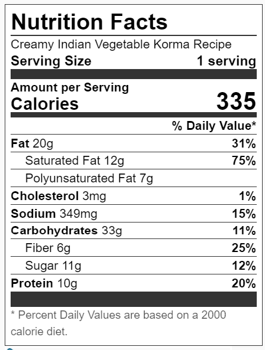

#   Table of contents
1.  [Creamy vegetable curry](#creamy-vegetable-curry)
2.  [Veg Korma](#veg-korma)
#   **Creamy vegetable curry** 
##  Recipe 1
Source: [Click here](https://simply-delicious-food.com/easy-creamy-vegetable-curry/)
### **Ingredients**
-   <input type="checkbox"> 500 g (1lb) sweet potato (butternut/pumpkin can also be substituted)
-   <input type="checkbox"> 700 g (1.5lb) cauliflower (broccoli)
-   <input type="checkbox"> 1 red pepper diced
-   <input type="checkbox"> 1 yellow pepper diced
-   <input type="checkbox"> 4 large zucchini roughly chopped
-   <input type="checkbox"> 200 g (7oz) baby spinach
-   <input type="checkbox"> 1 onion finely chopped
-   <input type="checkbox"> 4 garlic cloves crushed
-   <input type="checkbox"> 1 tsp crushed ginger
-   <input type="checkbox"> 2 tbsp Garam Masala
-   <input type="checkbox"> 1 tsp paprika
-   <input type="checkbox"> 1 tsp coriander
-   <input type="checkbox"> 2 tsp curry powder / spices of your choice (cumin, cardamom, a curry mix, etc.)
-   <input type="checkbox"> 1 tbsp tomato paste
-   <input type="checkbox"> 1 cup vegetable stock
-   <input type="checkbox"> 400 g coconut milk alternatively use heavy cream
-   <input type="checkbox"> pinch of sugar
-   <input type="checkbox"> salt and pepper to taste

### **Instructions**
1.   Cut the vegetables in similar-sized chunks. I always chop the peppers a little smaller since I prefer them that way.
1.   Very large cauliflower/broccoli florets can be halved/quartered. Place the vegetables (except for the spinach) on a large sheet pan and drizzle with olive oil.
1.   Season with salt then place in the oven and allow to roast for 30 minutes until caramelized and golden. 
1.   While the vegetable are roasting, make the curry base. Fry finely diced onion, garlic and ginger in a splash of oil until fragrant.
1.   Add the spices and tomato paste and allow to cook for a minute then pour in the stock.
1.   Scrape any sticky bits off the bottom of the pot then pour in the coconut milk/cream. Season with a pinch of sugar (optional), salt and pepper and allow to simmer.
1.   Cook for 10 minutes until the sauce has reduced and coats the back of a spoon.
1.   Add the roasted vegetables to the curry sauce along with the baby spinach and allow to cook for 5-10 minutes, adding more stock if necessary.
1.   Adjust seasoning and serve with rice, fresh coriander/cilantro and chopped chillies (optional). 

### **Nutrition**
|Item|Unit|
|---|---|
|Calories| 235kcal | 
|Carbohydrates|39g | 
|Protein|8g|
|Fat |6g | 
|Saturated Fat |5g | 
|Sodium |361mg | 
|Potassium |1532mg | 
|Fiber|10g | 
|Sugar|14g | 
|Vitamin A|16352IU | 
|Vitamin C|70mg |
|Calcium|128mg |
|Iron |3mg|
|||

#   **Veg Korma**
##  Recipe 1
Source: [Click here](https://thewanderlustkitchen.com/creamy-indian-vegetable-korma/)
###  **Ingredients**
FOR THE SAUCE
-   <input type="checkbox"> 1 medium yellow onion - peeled and halved
-   <input type="checkbox"> 3 cloves garlic - peeled
-   <input type="checkbox"> 1 1-inch piece ginger root, roughly chopped
-   <input type="checkbox"> 1 jalapeno pepper - stemmed and seeded
-   <input type="checkbox"> 1/4 cup raw cashews

FOR THE KORMA
-   <input type="checkbox"> 1 tablespoon vegetable oil
-   <input type="checkbox"> 2 teaspoons curry powder
-   <input type="checkbox"> 1 teaspoon ground turmeric
-   <input type="checkbox"> 1 teaspoon garam masala
-   <input type="checkbox"> 1/2 teaspoon cinnamon
-   <input type="checkbox"> 1/2 teaspoon coriander
-   <input type="checkbox"> 1/2 teaspoon kosher salt
-   <input type="checkbox"> 1/2 teaspoon ground black pepper
-   <input type="checkbox"> 1/8 teaspoon ground cardamom
-   <input type="checkbox"> 2 small tomatoes - diced
-   <input type="checkbox"> 1/2 cup canned - unsweetened full-fat coconut milk
-   <input type="checkbox"> 3/4 cup plain yogurt
-   <input type="checkbox"> 1 1/2 teaspoons brown sugar
-   <input type="checkbox"> 1 medium waxy potato - peeled and diced
-   <input type="checkbox"> 1 cup frozen peas and carrot mix
-   <input type="checkbox"> 1 cup chopped fresh green beans

### **Instructions**
1.  Place the onion, garlic, ginger, jalapeno, and cashews in the bowl of a blender along with ½ cup of water. Process until pureed.
1.  Heat the vegetable oil in a large sauté pan set over medium heat. While the oil heats, measure out all of the spices (the curry powder through cardamom) and place in a small bowl.
1.  Pour the pureed sauce mixture into the hot pan, using caution to avoid splatters. Stir in the pre-measured spices and allow to cook for 2 to 3 minutes, until fragrant.
1.  Add the tomato, coconut milk, yogurt, brown sugar, potato, peas-and-carrots, and green beans. Stir well, cover the pan, and allow to simmer on medium heat for 10 minutes.
1.  Uncover and cook a further 5 to 10 minutes, until the potatoes are tender. Serve with cooked basmati rice and naan bread.

